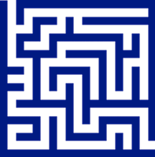

# Friendly Maze Game

## 1. Demo

Your mission is to build your own version of
[The Scary Maze Game](http://www.playscarymazegame.net/play-scary-maze-game/).

Navigate your mouse through the maze without touching the walls:



<a href="http://output.jsbin.com/xivifu/12" target="_blank_"></a>
<a href="http://jsbin.com/xivifu/12/edit?js,output" target="_blank_"></a>

## 2. How to Use This Tutorial

In this tutorial, instead of walking you through how to build everything from
scratch, we give you the code for how to make the maze game show above and
your mission will be to make your own version of it.

This workshop also, assumes that you have done the
[Dodge](https://github.com/hackedu/hackedu/blob/master/workshops/dodge/README.md)
workshop. Make sure you do that workshop first.

## 3. Setup

1. If you're more experienced and want to use your own editor, go ahead. Use the
   below files to your editor. Do note however that the rest of this tutorial be
   written assuming that you are using JS Bin.

    - [this HTML file](https://gist.githubusercontent.com/jonleung/11ecd13a9d957003416b/raw/625081d81cc9c941007ddfd54c9ffdeec0782d62/index.html)
    - [this JavaScript file](https://gist.githubusercontent.com/jonleung/11ecd13a9d957003416b/raw/625081d81cc9c941007ddfd54c9ffdeec0782d62/main.js)
    - and [this CSS file](https://gist.githubusercontent.com/jonleung/11ecd13a9d957003416b/raw/625081d81cc9c941007ddfd54c9ffdeec0782d62/style.css)

2. If you haven't already, make sure you have a JS Bin account first. <a
   href="https://jsbin.com/register" target="_blank_">Create one here.</a>
3. Then open <a target="_blank_"
   href="#TODO"> this JS Bin</a>. It has
   all the starter code we need for this tutorial. Write any new code in this JS
   Bin. We'll refer to this JS Bin as your _"working bin"_.

## 4. Understanding the Code

Let's understand the code in your working bin. There are two main parts:

1. Adding the maze sprite
2. Removing the maze if the player touches the maze

### Adding the Maze Sprite

Here is the top half of the code that is responsible for adding the maze sprite:

```js
var maze;
var mazeImg;

function setup() {
  createCanvas(400, 400);                 // create a canvas

  maze = createSprite(200, 200);          // create a sprite in the center
  mazeImg = loadImage('http://i.imgur.com/ImtI8zi.png');    // load an image
  maze.addImage(mazeImg);                 // make the sprite have an image
}

function draw() {
  background(255, 255, 255);              // clear the background
  drawSprites();                          // draw all the sprites
```

For a refresher for how to do the following, see the corresponding
sections from the Dodge workshop

- [creating a blank canvas](https://github.com/hackedu/hackedu/blob/master/workshops/dodge/blank_canvas.md)
- [adding a sprite](https://github.com/hackedu/hackedu/blob/master/workshops/dodge/add_player_sprite.md)
- [adding an image to your sprite](https://github.com/hackedu/hackedu/blob/master/workshops/dodge/player_image.md)

### Game Over Condition

The remainder of the code is responsible for removing the maze if the the mouse
touches it.

```js
  if(maze.overlapPixel(mouseX, mouseY)){  // if the mouse touches the image
    maze.remove();                           // remove the maze
  }
}
```

Note that `mouseX` represents the current **x** coordinate of the mouse and
`mouseY` represents the current **y** coordinate of the mouse.

With that, you can interpret the above line of code as:

If the mouse's `x` and `y` coordinates overlap with with one of the maze's
pixels, then remove the maze.

To get a more in depth explanation, ask your club leader.

## 5. Extending the Game

Now try extending the game on your own. Here are some things that you can try to
figure out how to do:

- try pausing the game before game starts
- instead of using the provided maze, try finding your own maze on Google Images
- try drawing and uploading your own maze to Imgur
- make it work on mobile by using `touchX` and `touchY` instead of `mouseX` and
  `mouseY`
- try making it say "Game Over" when you hit the walls of the maze
- try making it say "Win" when you reach the end of the maze
- try making a scary popup appear and a "scream" sound play after a certain
  amount of time or when the player reaches a certain part of the maze
- try adding different levels to the game
